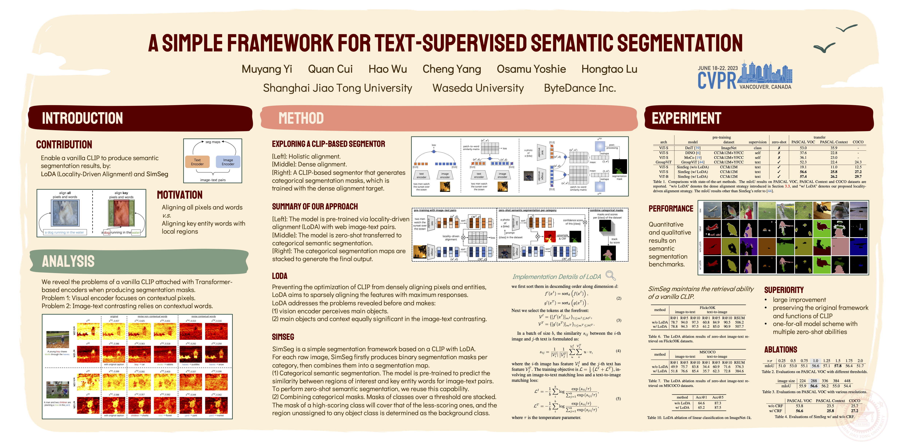

# SimSeg
[CVPR'23] A Simple Framework for Text-Supervised Semantic Segmentation

<p align="center">
  
</p>

## Links
Here are [[`Paper`](https://openaccess.thecvf.com/content/CVPR2023/html/Yi_A_Simple_Framework_for_Text-Supervised_Semantic_Segmentation_CVPR_2023_paper.html)] and [[`Video`](https://youtu.be/smL7mboV3l0)].

## Performance

Zero-shot Semantic Segmentation   
| Method  | Backbone | PASCAL VOC | PASCAL Context | COCO Stuff |
| --------| :--: | :--------: | :------------: | :--------: |
| SimSeg  | ViT-S |   56.6    |      25.8      |    27.2    |
| SimSeg  | ViT-B |   57.4    |      26.2      |    29.7    |

         
Zero-shot Image-Text Retrieval      
| Method  | Backbone | Dataset | I2T<br>R@1 | I2T<br>R@5 | I2T<br>R@10 | T2I<br>R@1 | T2I<br>R@5 | T2I<br>R@10 | RSUM |
|--------| :------: | :-----: | :--------: | :--------: | :---------: | :--------: | :--------: | :---------: | :--: |
| SimSeg  | ViT-B |  Flickr30K |    78.6    |    93.8    |     96.9    |    61.6    |    85.2    |     91.2    | 507.3 |
| SimSeg  | ViT-B |  MSCOCO    |    51.2    |    76.4    |     85.2    |    35.8    |    62.5    |     73.0    | 384.1 |


## Checkpoints
SimSeg checkpoints: [Google Drive](https://drive.google.com/drive/folders/1p2hO6LK1usO3q-S8ZtCK8jLaT941WPNW?usp=sharing)  
Please save the `.pth` files under the `ckpts/` folder.

```none
SimSeg
├── ckpts
│   ├── simseg.vit-b.pth
│   ├── simseg.vit-s.pth
```


## Dataset

We follow the [MMSegmentation Dataset Preparation](https://github.com/open-mmlab/mmsegmentation/blob/master/docs/en/dataset_prepare.md) to download and setup the test sets.     
It is recommended to arrange the dataset as the following.  
If your folder structure is different, you may need to change the corresponding paths in config files.

```none
SimSeg
├── data
│   ├── label_category
│   │   ├── pascal_voc.txt
│   │   ├── pascal_context.txt
│   │   ├── coco_stuff.txt
│   ├── VOCdevkit
│   │   ├── VOC2012
│   │   │   ├── JPEGImages
│   │   │   ├── SegmentationClass
│   │   │   ├── ImageSets
│   │   │   │   ├── Segmentation
│   │   │   │   │   ├── train.txt
│   │   │   │   │   ├── val.txt
│   │   ├── VOC2010
│   │   │   ├── JPEGImages
│   │   │   ├── SegmentationClassContext
│   │   │   ├── ImageSets
│   │   │   │   ├── SegmentationContext
│   │   │   │   │   ├── train.txt
│   │   │   │   │   ├── val.txt
│   │   │   ├── trainval_merged.json
│   ├── coco_stuff164k
│   │   ├── images
│   │   │   ├── train2017
│   │   │   ├── val2017
│   │   ├── annotations
│   │   │   ├── train2017
│   │   │   ├── val2017
```


### Pascal VOC

Pascal VOC 2012 could be downloaded from [here](http://host.robots.ox.ac.uk/pascal/VOC/voc2012/VOCtrainval_11-May-2012.tar).


### Pascal Context

The training and validation set of Pascal Context could be download from [here](http://host.robots.ox.ac.uk/pascal/VOC/voc2010/VOCtrainval_03-May-2010.tar). 

To split the training and validation set from original dataset, you may download `trainval_merged.json` from [here](https://codalabuser.blob.core.windows.net/public/trainval_merged.json).

Please install [Detail API](https://github.com/zhanghang1989/detail-api) and then run the following command to convert annotations into proper format.

```shell
python tools/convert_datasets/pascal_context.py data/VOCdevkit data/VOCdevkit/VOC2010/trainval_merged.json
```


### COCO Stuff

For COCO Stuff 164k dataset, please run the following commands to download and convert the augmented dataset.

```shell
# download
mkdir coco_stuff164k && cd coco_stuff164k
wget http://images.cocodataset.org/zips/train2017.zip
wget http://images.cocodataset.org/zips/val2017.zip
wget http://calvin.inf.ed.ac.uk/wp-content/uploads/data/cocostuffdataset/stuffthingmaps_trainval2017.zip

# unzip
unzip train2017.zip -d images/
unzip val2017.zip -d images/
unzip stuffthingmaps_trainval2017.zip -d annotations/

# --nproc means 8 process for conversion, which could be omitted as well.
python tools/convert_datasets/coco_stuff164k.py data/coco_stuff164k --nproc 8
```

The details of this dataset could be found at [here](https://github.com/nightrome/cocostuff#downloads).


## Environment
Requirements:
- Python 3.7
- Pytorch 1.10.0
- torchvision 0.11.1
- cuda 11.3
  
Install requirements:
```shell
pip install -r requirements.txt
pip install git+https://github.com/lucasb-eyer/pydensecrf.git

mim install mmcv-full==1.7.0
```


## Evaluation
After
1. Downloading pre-trained checkpoints.
2. Preparing evaluation data.   

The models could be evaluated by running the following scripts.   

#### Pascal VOC
```shell
python3 -m torch.distributed.launch --nproc_per_node=1 --master_port=65533 tools/seg_evaluation.py --ckpt_path=ckpts/simseg.vit-s.pth --cfg=configs/clip/simseg.vit-s.yaml
```

#### Pascal Context
```shell
python3 -m torch.distributed.launch --nproc_per_node=1 --master_port=65533 tools/seg_evaluation.py --ckpt_path=ckpts/simseg.vit-s.pth --cfg=configs/clip/simseg.vit-s.yaml data.valid_name=[pascal_context]
```

#### COCO Stuff
```shell
python3 -m torch.distributed.launch --nproc_per_node=1 --master_port=65533 tools/seg_evaluation.py --ckpt_path=ckpts/simseg.vit-s.pth --cfg=configs/clip/simseg.vit-s.yaml data.valid_name=[coco_stuff]
```

#### 
Switch to ViT-Base backbone by simply changing      
   
`--ckpt_path=ckpts/simseg.vit-s.pth --cfg=configs/clip/simseg.vit-s.yaml`    
    
to    
    
`--ckpt_path=ckpts/simseg.vit-b.pth --cfg=configs/clip/simseg.vit-b.yaml`   


## Evaluation (Image-Text Retrieval)
*Update 2025.01.26*

Please download the [datasets](https://drive.google.com/drive/folders/1CbSsCV5CMXYWxMDuMNtoM_p0eMGgGE1A?usp=sharing) and save them under the `data/` folder.

```none
SimSeg
├── data
│   ├── coco
│   │   ├── valid.parquet
│   ├── f30k
│   │   ├── valid.parquet
```


#### Run
```shell
python3 -m torch.distributed.launch --nproc_per_node=1 --master_port=65533 tools/retrieval_evaluation.py --ckpt_path=ckpts/simseg.vit-s.pth --cfg=configs/clip/simseg.vit-s.yaml data.valid_name=[f30k,coco] transforms.valid_transforms=[resize,center_crop] transforms.resize.size=324 transforms.center_crop.size=288 transforms.input_size=288
```

#### 
Switch to ViT-Base backbone by simply changing      
   
`--ckpt_path=ckpts/simseg.vit-s.pth --cfg=configs/clip/simseg.vit-s.yaml`    
    
to    
    
`--ckpt_path=ckpts/simseg.vit-b.pth --cfg=configs/clip/simseg.vit-b.yaml`   


## Acknowledgement
This work is based on [ZeroVL](https://github.com/zerovl/ZeroVL) (ECCV 2022).


## Citation
If you use SimSeg in your research, please use the following BibTeX entry.

```BibTeX
@inproceedings{yi2023simseg,
    author={Yi, Muyang and Cui, Quan and Wu, Hao and Yang, Cheng and Yoshie, Osamu and Lu, Hongtao},
    title={A Simple Framework for Text-Supervised Semantic Segmentation},
    booktitle={Proceedings of the IEEE/CVF Conference on Computer Vision and Pattern Recognition (CVPR)},
    year={2023},
    pages={7071-7080}
}
```

## License
SimSeg is released under the MIT license. See [LICENSE](LICENSE) for details.
